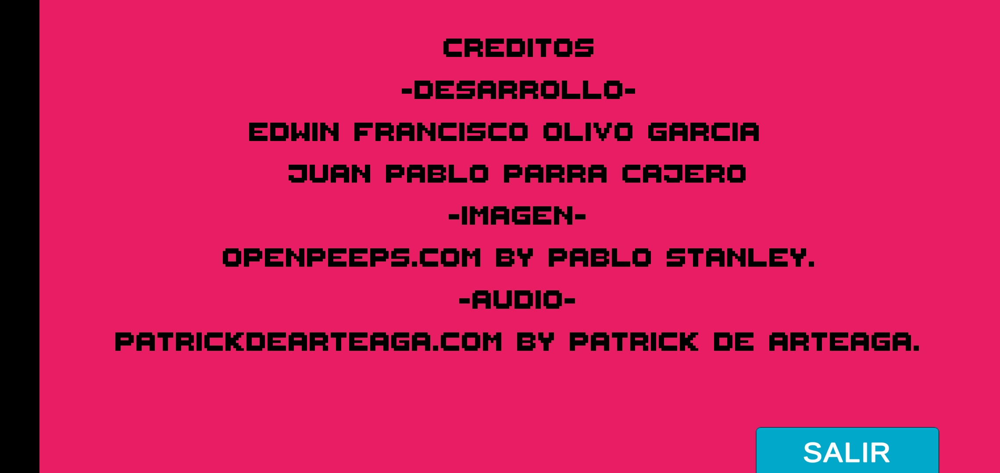

#   Programación de Videojuegos 2020
##  Trabajo Final (2/2) (Prototipo final)

Exponer su prototipo final. Les recomiendo utilizar los assets gratuitos para facilitar el desarrollo.

La fecha de entrega será el viernes 12 de Junio a las 16:00 horas. Tendrán 10 minutos para exponer su proyecto, tanto el funcionamiento como el código que utilizaron. De preferencia hagan una presentacion sobre de que se trata su juego, personajes principales, historia y dinámicas del juego, y después muestran el juego funcionando.

Deberán de compartir en una carpeta el prototipo en código fuente y el ejecutable o apk compilado para poder darles su calificación.

###    Materia
Programación de Videojuegos

###    Alumnos
-   Edwin Olivo
-   Juan Pablo Parra

### Screenshots
<table>
<tr>
  <td> 
       
        
       
  </td>
  <td> 
       
        
        
  </td>
 </tr>
</table> 
<table>
<tr>
  <td> 
       
        
       
  </td>
  <td> 
       
        
        
  </td>
 </tr>
</table> 
<table>
<tr>
  <td> 
       
        
       
  </td>
  <td> 
       
        
        
  </td>
 </tr>
</table> 
<table>
<tr>
  <td> 
       
        
       
  </td>
  <td> 
       
        
        
  </td>
 </tr>
</table>  
